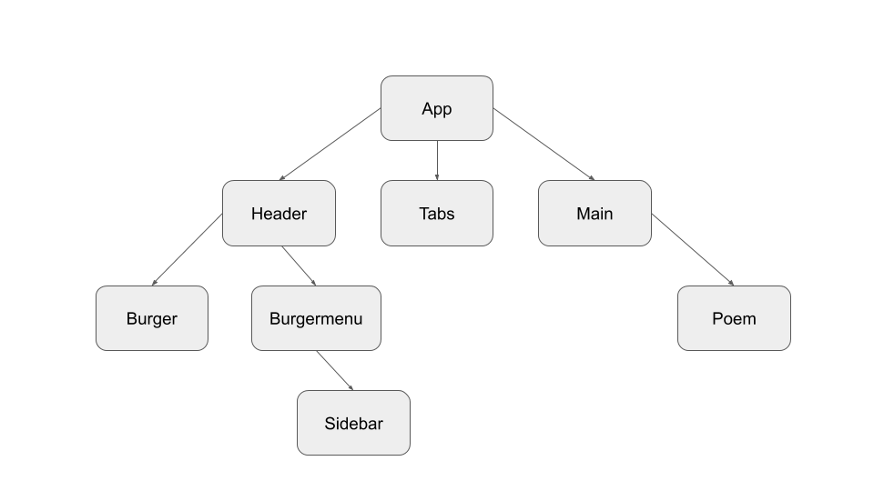

## Introduksjon

Utstillingen på nettsiden består av 9 ulike bilder med animasjon, 9 ulike dikt og 3 ulike lyder. Brukeren kan øverst på siden velge mellom 3 ulike installasjoner i samme kategori. I tillegg kan man i menyen på siden velge mellom 3 ulike kategorier for både bilde, lyd og dikt. Nederst på siden kan brukeren lagre sin favoritt kombinasjon av bilde, lyd og dikt, og få denne tilbake igjen. Brukeren kan også lagre kun sin favoritt lyd og hente denne tilbake igjen. I tillegg er det en knapp nederst på siden som kan brukes for å endre mellom 2 ulike fargetemaer for nettsiden. 

**Hvordan kjøre prosjektet**

Gå inn på linken: https://gitpod.idi.ntnu.no/#https://gitlab.stud.idi.ntnu.no/it2810-h20/team-41/prosjekt-2

I terminalen nederst på siden må du kjøre disse kommandoene for å starte nettsiden:

	cd prosjekt-2
	npm install
	npm start

## Teknologi

**React**

Prosjektet vårt benytter seg av React med både klasser og funksjonelle komponenter implementert med TSX.

**Fetch med AJAX**

Fetch APIet tilbyr et grensesnitt for javascript for å aksesserer og manipulere deler av pipelinen til HTTP, slik som request og response. Nettsiden tar bruk av den innebygde fetch-funksjonen i javascript, for å hente diktene fra APIet PoetryDB. Responsen parses om til JSON slik at dataen enkelt kan manipuleres og sendes ut på siden. For å unngå å gjøre mange kall til PoetryDB henter vi alle 9 diktene som vi ønsker i ett kall. Diktene lagres i staten til komponenten. Dette resulterer i få kall med bruk av fetch og derfor også lite ventetid på at kallene til databasen skal fullføres.

## React komponent hierarki

Vi fant tidlig ut av at det er funksjonelle komponenter som er en trend innen bruk av React, og at det er populært blant annet annet fordi det er raskere å utvikle, enklere å teste og fører ofte til kortere kode. Vi har derfor valgt å bruke funksjonelle komponenter mest i dette prosjektet. Dette ga oss mulighetene til å bruke hooks, og spesielt context, som var praktisk fordi det ga oss tilgang til alt av state i alle filer uten å måtte sende props gjennom hele hierarkiet vårt. Tidligere hadde man ikke tilgang til state i funksjonelle komponenter, og det var derfor vanlig å bruke klasser istedenfor, men dette endret seg når man kunne bruke hooks. 
Siden bruk av klasser er et krav i dette prosjektet har vi brukt det også, det er brukt i filene Poem og Header.

**Global State Context**

For å holde orden på staten i applikasjonen valgte vi å bygge ut en global state context. Ettersom komponenthirakiet økte i kompleksitet fremsto dette som et gunstigere alternativ enn å sende gjennom props for å sikre en konsis state i applikasjonen. Svært mange av komponentene var avhengig av hverandres state noe som var enda et argument for å lage en global state som holdt en felles oversikt i applikasjonen og sørget for riktig tilstand.

* **App:** Her håndteres det meste av lagring med HTML Web Storage
* **Main:** Her hentes det ut riktig bilde, lyd og dikt etter hvilken knapp som er aktiv.
* **Burger og Burgermenu:** Burger-komponenten skifter props til “isOpen” når den trykkes på, dette sendes til Burgermenu-komponenten som da vil åpne “Sidebar”-menyen
* **Sidebar:** Inneholder alle kategoriene man kan velge
* **Header:** Holder state til Burger og Burgermenu
* **Tabs:** Har knappene og onClick funksjonene til de tre knappene øverst på siden
* **GlobalStateContext:** Håndtering av staten til alle knappene, lagret som context

## Lagring med HTML Web Storage

Vi har laget mulighet for lagring med både Local Storage og Session Storage.

Vi har brukt Local Storage til å la brukeren kunne lagre sin favoritt installasjon. Da lagres kombinasjonen av bilde, lyd og dikt, og dette kan brukeren finne tilbake til ved å trykke på “Get favorite installation”. Hvis brukeren trykker på “Get favorite installation” før den har lagret en favoritt, vil den få beskjed om at den må lagre en favoritt installasjon først.

Session Storage har vi brukt til å la brukeren kunne lagre sin favoritt lyd og hente denne tilbake igjen senere. Her vil brukeren også få opp en beskjed om at den må lagre en favoritt først dersom brukeren prøver å hente ut favoritt lyden før den har lagret en. 

## Testing

Vi har brukt snapshot testing på komponentene Basket, Tabs og Burger. Disse ligger i en egen test mappe, og er kjørt lokalt på pc-en ved å skrive npm test i terminalen. De fungerer som de skal alle sammen, og har ingen feil når de kjøres. Siden det ikke skulle legges vekt på omfanget av testingen, men at man har forstått prinsippet, mente vi at det ikke var nødvendig å lage sammen test for flere av filene. Men hvis det skulle vært gjort kunne resten av komponentene vært testet på akkurat samme måte.

**Testing av responsiv design på ulike enheter**
Da vi jobbet med designet for å gjøre nettsiden mer responsiv testet vi den jevnlig i “inspiser”-vinduet. Vi tok hovedsakelig utgangspunkt i IPhone X og IPad siden dette er to ganske standard skjermstørrelser, og sjekket på andre mobiltyper etterpå. Vi testet også å få nettsiden opp på en fysisk mobil, og så da at noen av knappene kunne være vanskelige å trykke på, og tilpasset etter dette.

**Enheter som har blitt testet på**

* **Mobil:** IPhone X og 6/7/8, Galaxy S5, Pixel 2
* **Tablet:** IPad
* **PC:** MacBook Pro 13, Surface Laptop, HP Pavillon

## Responsiv web design

Layouten på nettsiden tilpasses etter skjermstørrelsen og designet fungerer dermed fint på både desktop, Ipad og mobil. Dette gjøres ved hjelp av Flexbox og media queries, som blant annet får teksten til å legge seg under diktene når skjermen blir smalere enn 1050px, slik at innholdet til enhver tid utnytter skjermen på en god måte. Vi har satt standard mobilskjerm-bredde til skjermstørrelse under 600px, og det meste på skjermen vil da forminskes blant annet bildene, knappene og headeren. 

Vi startet først med å designe for desktop og måtte derfor etter hvert gjøre noen endringer for å enklere kunne tilpasse siden til mobilversjon. Blant annet byttet vi menyen ut med en burgermeny for at den ikke skulle ta opp for mye plass, og lot de øverste knappene bre seg utover hele skjermen og tilpasse seg til den. Neste gang ville vi startet med å designe for mobil først, for å unngå disse ekstra endringene

Vi valgte å kun bruke CSS Flexbox fremfor grid, etter å ha testet begge deler og kommet  frem til at Flexbox var enklest å jobbe med. Flexbox fungerte bra for å tilpasse hvordan elementene skulle legge seg rundt hverandre når vi endret skjermstørrelsen.

Viewport kommer integrert i React i index.html filen i public-mappen. Dette er brukerens synlige del av skjermen og bredden er her satt til bredden på skjermen.

## Git

Vi valgte å lage en egen branch (dev) som vi brukte i utviklingsfasen til prosjektet. Denne ble brukt til å lage nye brancher ut fra og til å merge branchene inn i. Dette var for å unngå å ha et uferdig prosjekt i master. Vi prøvde å gi branchene navn som beskrev det vi jobbet med. Vi var også veldig nøye med å ikke jobbe i samme brancher, som gjorde at vi unngikk større problemer under merge. 
Vi la inn mindre oppgaver vi måtte gjøre som issues i GitLab underveis i prosjektet. Dermed hadde vi alltid god oversikt over hvilke oppgaver vi ikke hadde gjort enda. Når vi hadde jobbet med disse oppgavene refererte vi til issuens id i commit meldingen. 

## Kilder

Vi eier ikke SVG bildene, de er hentet herfra:

**Kilde:** https://undraw.co/illustrations

**Bildenavn:**

Basketball 

Grand slam

Junior soccer

Shared workspace

On the office

Working from anywhere

Partying

Having fun

Festivities

Lydfilene er hentet herfra:

**Kilde:** https://www.audiomicro.com
